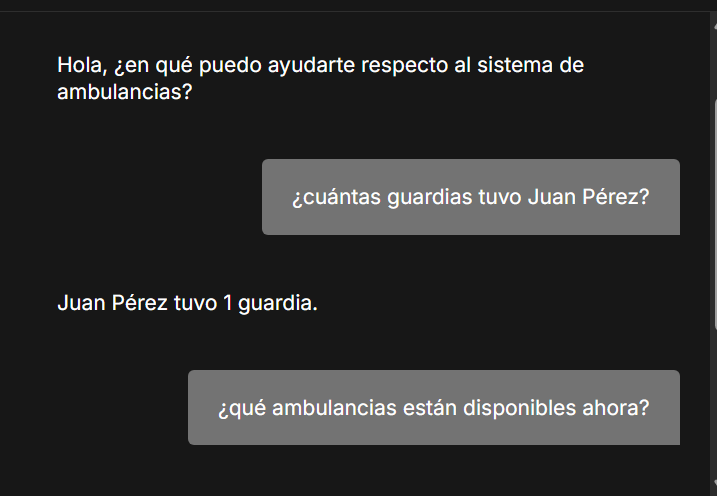
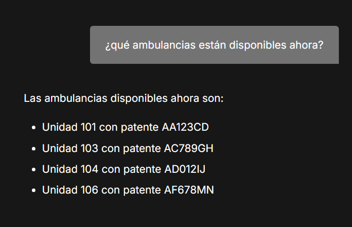
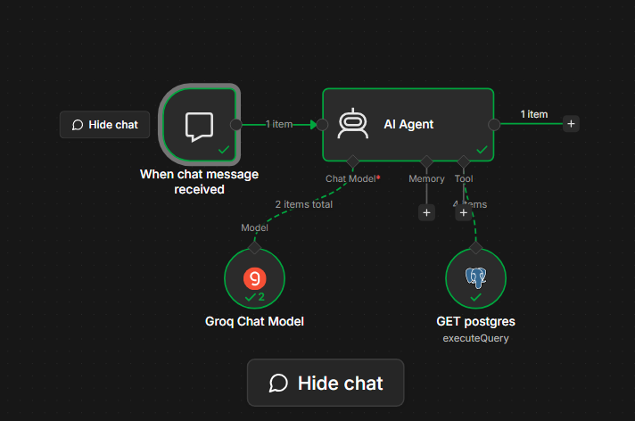

# E!line 🚑

Sistema de gestión y consulta para una flota de ambulancias, con un agente de IA que responde preguntas en lenguaje natural sobre guardias, personal y asignaciones, consultando directamente una base de datos Postgres.

## ¿De qué se trata?

E!line permite consultar el estado operativo de una flota de ambulancias (personal, guardias, asignaciones) a través de un chat conversacional. En vez de escribir consultas SQL manualmente, el usuario le pregunta al chatbot en lenguaje natural — por ejemplo _"¿cuántas guardias tuvo Juan Pérez esta semana?"_ — y el agente de IA genera y ejecuta la consulta correspondiente contra la base de datos, devolviendo la respuesta en texto simple.

El proyecto integra:

- **n8n** como orquestador del flujo conversacional (chat trigger, agente de IA, herramientas)
- **Groq** como proveedor del modelo de lenguaje (LLM en la nube)
- **PostgreSQL** como base de datos relacional, corriendo en un contenedor Docker
- **Docker / Docker Compose** para levantar todo el entorno de forma reproducible
- **DietPi + VirtualBox** como entorno de virtualización sobre el cual corre todo el stack

## Arquitectura

```
Usuario (chat de n8n)
        │
        ▼
 Chat Trigger (n8n)
        │
        ▼
   AI Agent (n8n) ──── Groq Chat Model (LLM)
        │
        ▼
 Postgres Tool (n8n) ──── genera y ejecuta SQL dinámicamente
        │
        ▼
   PostgreSQL (Docker)
```

El AI Agent recibe la pregunta del usuario, decide qué consulta SQL necesita ejecutar según el esquema de la base (tablas de personal, guardias, ambulancias, asignaciones, etc.), la corre contra Postgres a través de una tool, y devuelve la respuesta en lenguaje natural.

## Modelo de datos

La base cuenta con las siguientes tablas principales:

| Tabla        | Descripción                                                                       |
| ------------ | --------------------------------------------------------------------------------- |
| `tipo`       | Tipos de ambulancia (UTIM, UEM, Traslado básico)                                  |
| `estado`     | Estados posibles de una ambulancia (Disponible, En Servicio, Mantenimiento, etc.) |
| `rol`        | Roles del personal (Chofer, Enfermero, Médico)                                    |
| `ambulancia` | Flota de unidades, con su tipo y estado actual                                    |
| `personal`   | Staff registrado, con su rol asignado                                             |
| `guardia`    | Turnos de guardia por persona (inicio y fin)                                      |
| `asignacion` | Tripulación asignada a cada ambulancia por guardia (chofer + enfermero)           |

El script completo de creación de tablas y datos de prueba está en [`db.sql`](./db.sql).

## Cómo levantar el proyecto

### Requisitos previos

- Docker y Docker Compose instalados
- Una API key de [Groq](https://console.groq.com) (gratuita)

### 1. Clonar el repositorio

```bash
git clone https://github.com/tu-usuario/eline.git
cd eline
```

### 2. Levantar los contenedores

```bash
docker-compose up -d
```

Esto levanta dos servicios:

- **n8n** en el puerto `5678`
- **postgres** en el puerto `5432`

Verificá que ambos estén corriendo:

```bash
docker ps
```

### 3. Crear las tablas y datos de prueba

```bash
docker exec -i postgres_db psql -U admin -d tp_final < db.sql
```

### 4. Configurar n8n

1. Entrá a `http://localhost:5678` (o `http://dietpi.local:5678` si usás el hostname configurado)
2. Importá el workflow desde [`workflow.json`](./workflow.json)
3. Configurá las credenciales:
    - **Postgres**: host `postgres`, puerto `5432`, base `tp_final`, usuario y contraseña según tu `.env`
    - **Groq**: pegá tu API key de [console.groq.com](https://console.groq.com)
4. Activá el workflow

### 5. Probarlo

Abrí el chat del workflow en n8n y probá con preguntas como:

- _"¿Cuántas guardias tuvo Juan Pérez esta semana?"_
- _"¿Qué ambulancias están disponibles ahora?"_
- _"¿Quién está asignado a la unidad 101?"_

## Variables de entorno

El `docker-compose.yml` usa las siguientes variables (podés definirlas directamente ahí o en un `.env`):

```env
POSTGRES_USER=admin
POSTGRES_PASSWORD=tu_password
POSTGRES_DB=tp_final
```

## Capturas





## Stack tecnológico

- **n8n** — orquestación de workflows y agente de IA
- **Groq** — modelo de lenguaje en la nube (LLM)
- **PostgreSQL 16** — base de datos relacional
- **Docker / Docker Compose** — contenerización y despliegue
- **DietPi (Linux) + VirtualBox** — entorno de virtualización

## Autor

    Bobadilla Daiana, Cristaldo Fiorela, Skwarek Yanina — Trabajo Práctico Final
